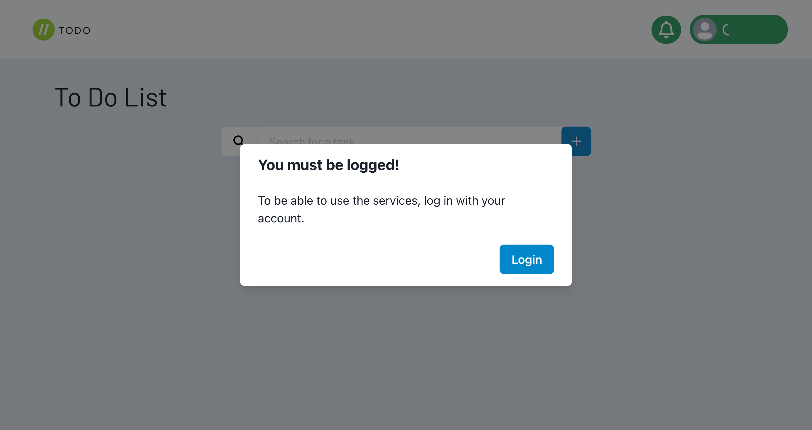
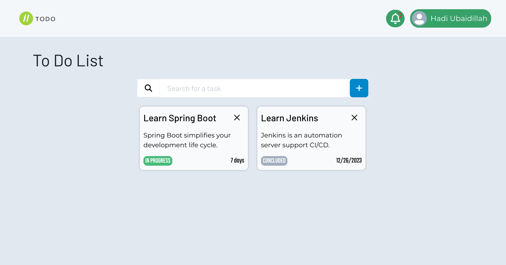
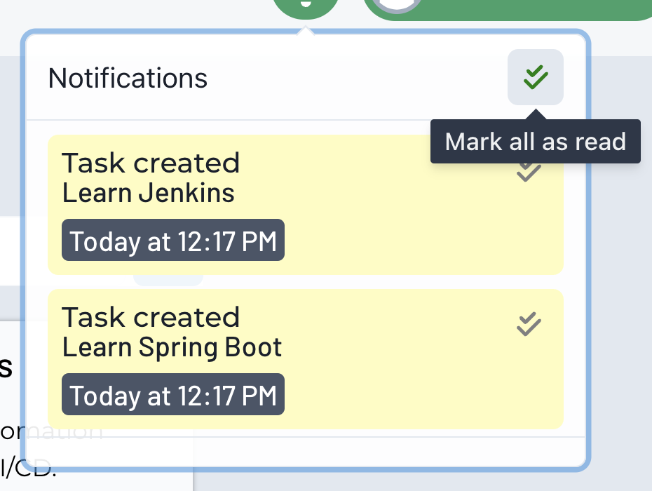
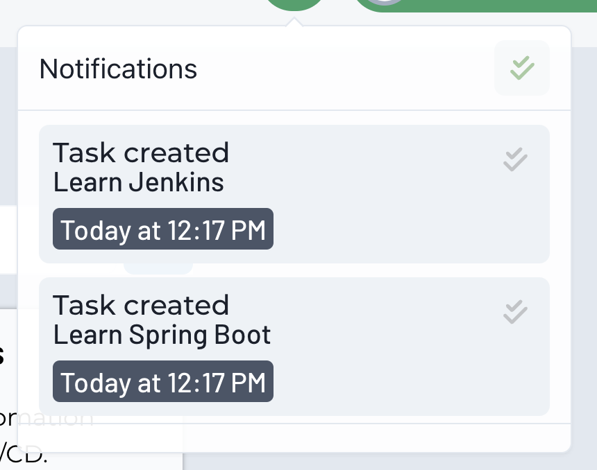
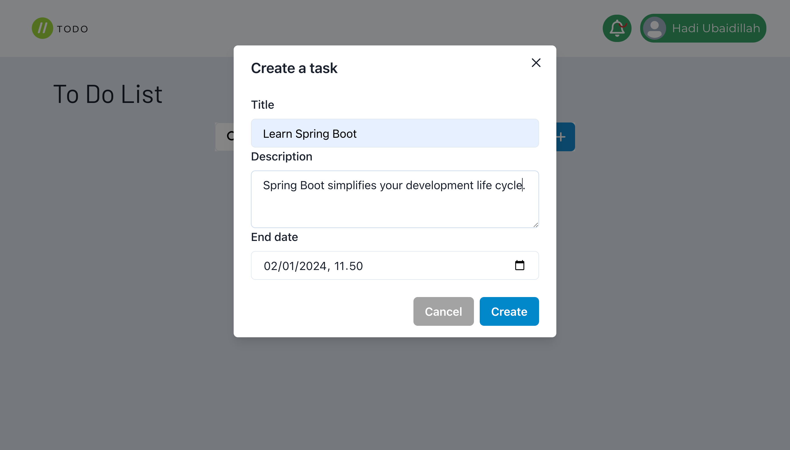

  

    
    <h1 align="center">Todo Application</h1>
  

    <h2>Tasks with notifications</h2>
    
A task app using microservices architecture with the Spring Cloud, RabbitMQ, Keycloak and React ecosystem.

---

## Project

This is a practical project using microservices architecture with the Spring Cloud ecosystem.

I used some of the most used tools for this architecture such as Spring Cloud Netflix Eureka, RabbitMQ, Spring Cloud Gateway and Spring Cloud Loadbalancer.

4 microservices were created, which are:

| Service | Description |
| -- | -- |
| [`tasks-api`](https://github.com/Cristian-SknZ/todo-app/tree/master/tasks-api) | A simple Rest API for task management.|
| [`tasks-notifications`](https://github.com/Cristian-SknZ/todo-app/tree/master/tasks-notifications) | A service that manages, schedules task notifications, and sends email notifications. It has a Rest API for querying notifications. |
| [`tasks-discovery`](https://github.com/Cristian-SknZ/todo-app/tree/master/tasks-discovery) | Discovery service using Spring Cloud Netflix Eureka Server. |
| [`tasks-gateway-server`](https://github.com/Cristian-SknZ/todo-app/tree/master/tasks-gateway-server) | Routing and load balancing service using Spring Cloud Gateway and Spring Cloud Loadbalancer. |

Other services were also used, such as:
* `RabbitMQ` RabbitMQ used for AMQP communication between microservices.
* `Keycloak` Keycloak used for authorization and authentication of users with the OAuth2 and OpenId Connect protocols.
* `PostgreSQL` Database used in microservices.

This entire environment was designed to run in Docker containers, and is configured for a development environment.

The correct thing to do in a microservices architecture is to use a separate database for each service to avoid coupling between services, but I wouldn't be able to run the complete environment on my machine, which is why I decided not to do that.

### Application routes
As I explained earlier, there are two REST APIs, one for the task service and one for the notification service.

The `tasks-api` service routes are:

| Method | Route | Description |
| --- | --- | --- |
| GET | /tasks | Returns all registered tasks |
| GET | /tasks/{id} | Returns the task with the specified id |
| POST | /tasks | Create a new task |
| PUT | /tasks/{id} | Updates the task with the specified id |
| DELETE | /tasks/{id} | Removes the task with the specified id |

While the `tasks-notifications` service routes are:

| Method | Route | Description |
| --- | --- | --- |
| GET | /notifications/all | Returns all notifications |
| GET, DELETE | /notifications/{id} | Returns or deletes the notification with the specified id |
| GET | /notifications/unreads | Returns all unread notifications |
| PUT | /notifications/unreads | Mark all notifications as read |
| GET | /notifications/unreads/{id} | Returns the unread notification with the specified id |
| PUT | /notifications/unreads/{id} | Mark the notification with the specified id as read |

---

### Front End

I created a simple UI with all the resources available in microservices, I decided to style the application with ChakraUI which has the css in js approach with some ready-made components such as Modals and Popovers.

To be able to use the application's services, you must be authenticated. When you press "Log in", the user will be redirected to the Keycloak authentication server.

After logging in, the application will show all existing tasks, and will also show notifications.

| | |
| -- | -- |
|  |  |

They are available in the application and can be read at any time. After a task is completed, an email notification is sent.

When creating a task, it is possible to assign a title, description and when the task will end.

--- 

## Start the environment

For you to be able to run the entire environment, you will need some requirements:
* Java 21+
* Gradle 8.5 or newer.
* NodeJS 16+
* Docker

After meeting the requirements, you will need to build all services to facilitate the process
I created a script to do this, just run the command `sh ./build.sh` in the root of the project.

With the build completed, all that remains is to run the project with the `sh ./run.sh` script. Wait for all services to go up
and then you can access the application UI via IP `http://localhost:5173/`.

The services are all configured correctly, with no additional configuration required.

---

## Conclusion

This project, despite seeming simple, contains more complex things in its architecture, such as understanding how microservices work, their asynchronous communication, authentication with Single-Sign On and other knowledge of libraries from the Spring Cloud family.

The development of this project was due to my learning with microservices, it was not a project that I intended to make public. In order to show my practice and knowledge on the topic in my portfolio, I decided to make this project public.