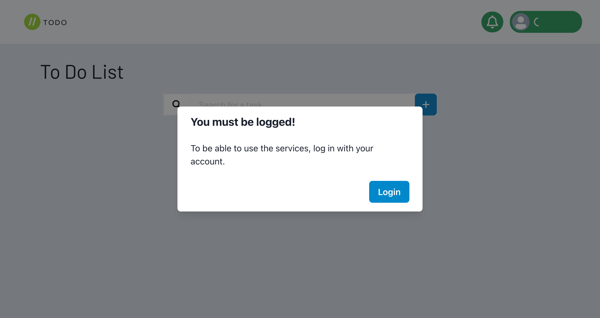
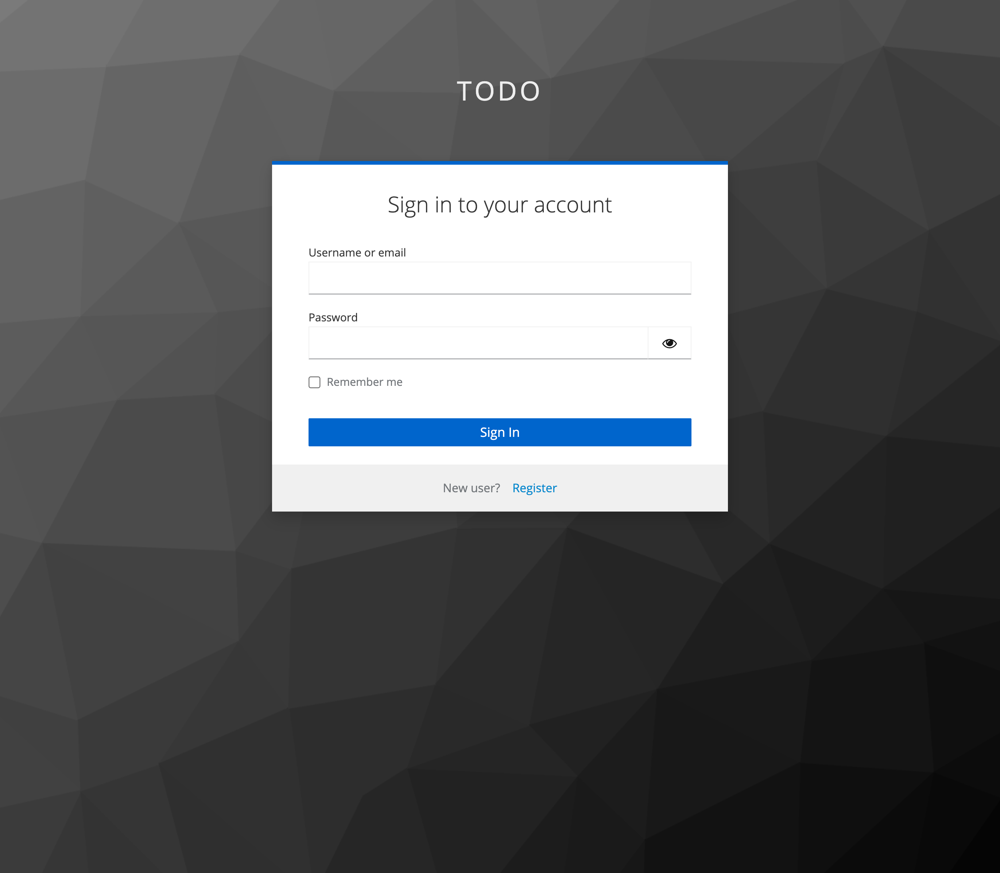
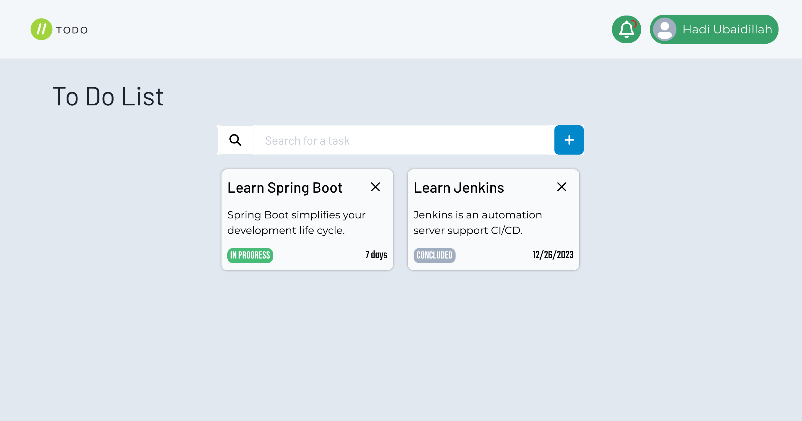
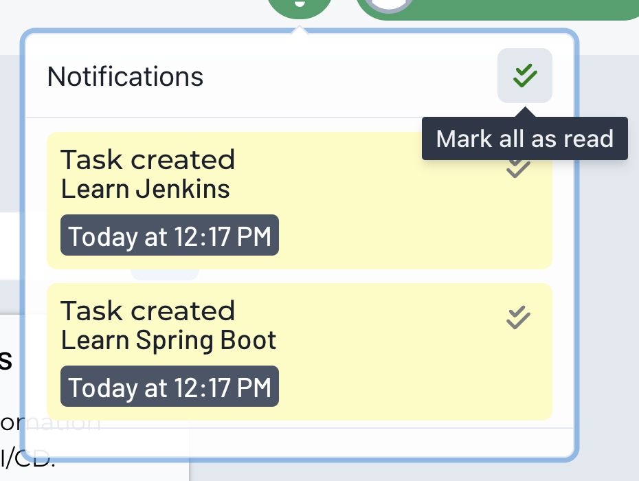
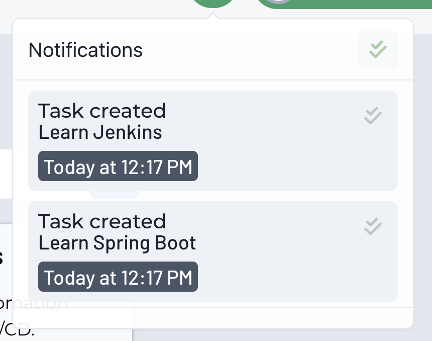
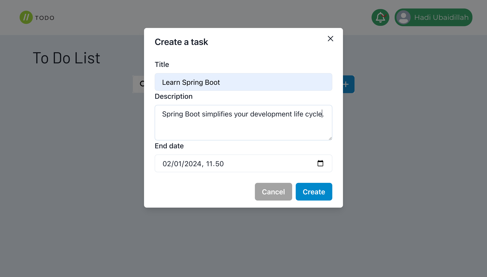

<div align="center">
  <div>
    
    <h1 align="center">Todo Application</h1>
  </div>
  <h2>Task management with email notifications</h2>
  <p>A full-stack task management app built on a microservices architecture using Spring Boot, Angular, Keycloak, and RabbitMQ.</p>
</div>

---

## Project

This project is a practical implementation of a microservices architecture using the Spring Cloud ecosystem. It covers key patterns such as service discovery, API gateway, asynchronous messaging, distributed tracing, and SSO-based authentication.

The backend is split into 4 microservices:

| Service | Description |
|---|---|
| `discovery-server` | Service registry using Spring Cloud Netflix Eureka. |
| `gateway-server` | API gateway and load balancer using Spring Cloud Gateway and Spring Cloud Loadbalancer. |
| `todo-service` | REST API for creating and managing tasks. Publishes task events to RabbitMQ. |
| `notification-service` | Consumes task events from RabbitMQ, schedules notifications, and sends email alerts. |

Supporting infrastructure services:

| Service | Purpose |
|---|---|
| `PostgreSQL 18.2` | Primary database (separate schema per service). |
| `RabbitMQ 4.0` | Asynchronous messaging between microservices (with delayed message exchange). |
| `Keycloak 26.5.3` | Authentication and authorization via OAuth2 and OpenID Connect. Supports Google, GitHub, and Facebook login. |
| `Redis` | Caching layer used by the gateway and backend services. |
| `Zipkin` | Distributed tracing. |
| `Prometheus + Grafana` | Metrics collection and visualization. |
| `Loki + Promtail` | Log aggregation. |
| `AlertManager` | Alert routing from Prometheus. |

---

## Architecture

```
Browser
  │
  ▼
Angular 21 SPA (port 4200 / 80)
  │
  │  OAuth2 / OpenID Connect
  ├──────────────────────────────► Keycloak (port 8083)
  │
  │  REST API calls (JWT)
  ▼
Gateway Server (port 8080)
  │  Spring Cloud Gateway + Loadbalancer
  ├──────────────────► Todo Service (port 8081)
  │                         │
  │                         │ AMQP (RabbitMQ)
  │                         ▼
  └──────────────► Notification Service (port 8082)
                            │
                            └──► SMTP (email)

All services registered at → Discovery Server (port 8761)
```

---

## API Routes

All requests go through the gateway at `http://localhost:8080/api/v1`.

**Todo Service** (`/tasks`):

| Method | Route | Description |
|---|---|---|
| GET | `/tasks` | Returns all tasks for the authenticated user. |
| GET | `/tasks/{id}` | Returns the task with the specified ID. |
| POST | `/tasks` | Creates a new task. |
| PUT | `/tasks/{id}` | Updates the task with the specified ID. |
| DELETE | `/tasks/{id}` | Deletes the task with the specified ID. |

**Notification Service** (`/notifications`):

| Method | Route | Description |
|---|---|---|
| GET | `/notifications/all` | Returns all notifications. |
| GET | `/notifications/{id}` | Returns the notification with the specified ID. |
| DELETE | `/notifications/{id}` | Deletes the notification with the specified ID. |
| GET | `/notifications/unreads` | Returns all unread notifications. |
| PUT | `/notifications/unreads` | Marks all notifications as read. |
| GET | `/notifications/unreads/{id}` | Returns the unread notification with the specified ID. |
| PUT | `/notifications/unreads/{id}` | Marks a specific notification as read. |

---

## Frontend

The frontend is an Angular 21 SPA styled with PrimeNG and Tailwind CSS.



To use the application, users must authenticate via Keycloak. Login with a local account or through Google, GitHub, or Facebook.





After logging in, all tasks are displayed along with the notification panel. When a task deadline is reached, an email notification is sent automatically.

| | |
|--|--|
|  |  |



When creating a task, you can set a title, description, and due date. The notification service will schedule and deliver a reminder email at the specified time.

---

## Running the Project

### Prerequisites

- Docker & Docker Compose
- Java 25+
- Node.js 18+

### Environment variables

Copy the example file and fill in the OAuth credentials for social login providers:

```bash
cp .env.example .env
```

`.env` variables:

```env
GOOGLE_CLIENT_ID=your-google-client-id
GOOGLE_CLIENT_SECRET=your-google-client-secret
GITHUB_CLIENT_ID=your-github-client-id
GITHUB_CLIENT_SECRET=your-github-client-secret
FACEBOOK_CLIENT_ID=your-facebook-app-id
FACEBOOK_CLIENT_SECRET=your-facebook-app-secret
```

For email notifications, edit the notification service environment in `docker-compose.yml`:

```env
MAIL_SMTP_HOST=smtp.example.com
MAIL_SMTP_PORT=587
MAIL_SMTP_USERNAME=noreply@example.com
MAIL_SMTP_PASSWORD=your-password
```

### Start with Docker Compose

```bash
docker-compose up
```

This will start all services. Wait for Keycloak and the databases to finish initializing before accessing the app.

### Service URLs

| Service | URL | Credentials |
|---|---|---|
| Frontend | http://localhost:4200 | — |
| API Gateway | http://localhost:8080/api/v1 | Bearer token (via Keycloak) |
| Keycloak Admin | http://localhost:8083 | `admin` / `admin` |
| Eureka Dashboard | http://localhost:8761 | — |
| RabbitMQ Management | http://localhost:15672 | `guest` / `guest` |
| PgAdmin | http://localhost:5050 | `admin@admin.com` / `admin` |
| Prometheus | http://localhost:9090 | — |
| Grafana | http://localhost:3000 | `admin` / `admin` |
| Zipkin | http://localhost:9411 | — |
| AlertManager | http://localhost:9093 | — |

### Keycloak realm

The `todo` realm is imported automatically on startup from `infrastructure/keycloak/todo-realm.json`.

A demo user is pre-configured:

| Username | Password | Role |
|---|---|---|
| `demo` | `demo` | `USER` |

---

## Kubernetes Deployment

The project includes Kubernetes manifests using Kustomize.

```bash
# Deploy with full infrastructure (PostgreSQL, RabbitMQ, Keycloak, etc.)
kubectl apply -k k8s/overlays/full

# Deploy with external managed databases
kubectl apply -k k8s/overlays/external
```

Secrets for PostgreSQL, RabbitMQ, Keycloak, and mail must be applied before deployment. See `k8s/secrets/` for the required secret definitions.

The ingress is configured for:
- `todo.hadiubaidillah.com /` → Frontend
- `todo.hadiubaidillah.com /api` → Gateway Server

---

## Tech Stack

| Layer | Technology |
|---|---|
| Backend | Spring Boot 4.0.2, Kotlin 2.3.10 |
| Service Discovery | Spring Cloud Netflix Eureka |
| API Gateway | Spring Cloud Gateway, Spring Cloud Loadbalancer |
| Frontend | Angular 21, PrimeNG, Tailwind CSS 4 |
| Auth | Keycloak 26.5.3 (OAuth2, OpenID Connect, Google / GitHub / Facebook IdP) |
| Messaging | RabbitMQ 4.0 |
| Database | PostgreSQL 18.2 |
| Cache | Redis |
| Resilience | Resilience4j |
| Tracing | Zipkin |
| Observability | Prometheus, Grafana, Loki, Promtail, AlertManager |
| Containers | Docker, Docker Compose, Kubernetes (Kustomize) |
